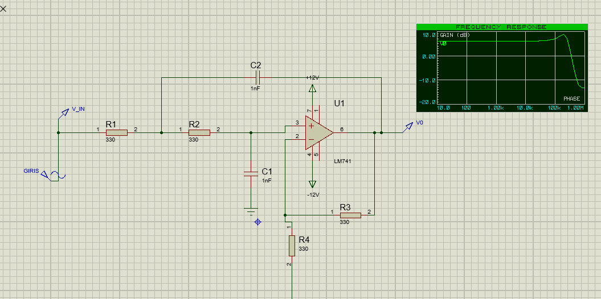
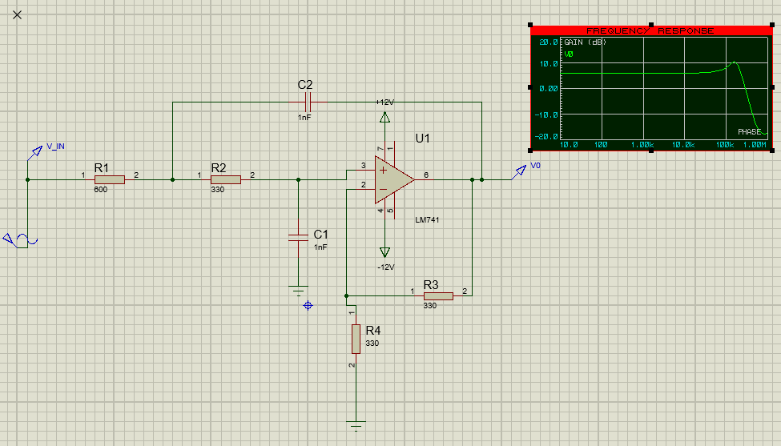
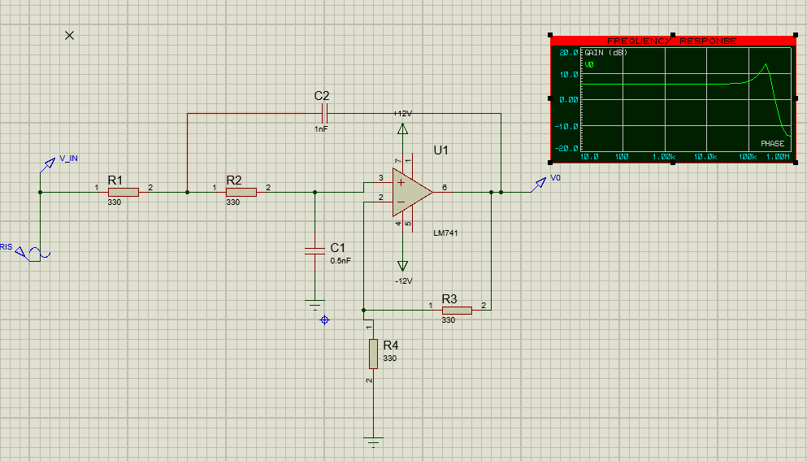

# Machine Learning-Based Analog Circuit Fault Diagnosis (ACFD)

## Overview
This project bridges the gap between hardware circuit analysis and artificial intelligence. It demonstrates how machine learning algorithms can be trained to detect and classify "soft faults" (parametric degradations like aging components) in an analog circuit by analyzing its frequency response.

The target circuit is a **Sallen-Key Low-Pass Filter** with an amplifier stage. By utilizing AC Sweep (Bode Plot) data generated in Proteus and applying Monte Carlo-style data augmentation in Python, a **Random Forest Classifier** was trained to achieve **100% fault detection accuracy**.

## Technologies & Tools
*   **Circuit Simulation:** Proteus Design Suite (ISIS)
*   **Machine Learning:** Python (Google Colab)
*   **Libraries:** `pandas`, `numpy`, `scikit-learn`, `matplotlib`, `seaborn`

## Project Workflow

### 1. Baseline Simulation (Hardware Level)
A Sallen-Key Low-Pass Filter (fc ≈ 1.59 kHz, Gain = 2) was designed in Proteus using an LM741 Op-Amp. Three distinct physical conditions were simulated using an AC Sweep analysis (10 Hz to 10 MHz) to extract the foundational frequency response signatures.

Below are the Proteus schematics and their corresponding frequency response (Bode Plot) curves for each simulated condition:

Class 0 (Healthy Baseline)**  
Nominal component values (R1 = 330Ω, C1 = 1nF). The gain remains flat at ~6.02 dB at low frequencies and smoothly rolls off after the cutoff frequency.  

Class 1 (R1 Faulty - Degraded/Overheated)**  
R1 degraded to 600Ω. This results in an increased Q-factor, visible as a localized gain peak (bump) just before the cutoff frequency.  

Class 2 (C1 Faulty - Dried Capacitor)**  
C1 degraded/dried to 0.5nF. This results in a severe resonance spike, drastically altering the filter's characteristic and shifting the circuit's behavior.  

### 2. Overcoming the "Data Shape Trap"
Initially, feeding the raw point-by-point frequency/gain data into the model resulted in a 0% accuracy. The model failed because, at lower frequencies, all three conditions shared the exact same gain (6.02 dB), making individual points indistinguishable. 
*Solution:* The approach was shifted from analyzing *individual data points* to analyzing the *entire frequency curve* as a single holistic feature set.

### 3. Data Augmentation (Monte Carlo Approach)
To train the model effectively without running hundreds of manual simulations, a synthetic data generation script was implemented in Python. 
By adding Gaussian noise (representing natural measurement tolerances) to the three baseline curves, **3,000 unique circuit simulations** (1,000 per class) were generated. Each row in the final dataset represented a complete frequency response curve.

### 4. Machine Learning Model Training
The augmented dataset was split into 80% training and 20% testing sets. A **Random Forest Classifier** (`n_estimators=100`) was selected for its robustness in handling high-dimensional feature sets (where each frequency step acts as a feature).

## Results
The Random Forest model successfully learned the unique "fingerprints" (peaking characteristics and resonance spikes) of each fault condition.

*   **Model Accuracy:** **100.00%**
*   **Confusion Matrix:** The model achieved perfect classification across the test set, successfully distinguishing between a healthy circuit, a degraded resistor, and a dried capacitor with zero false positives or false negatives.

## How to Run
1. Clone this repository.
2. Open the provided Jupyter Notebook (`ACFD_RandomForest.ipynb`) in Google Colab or your local environment.
3. Ensure the three baseline CSV files (`healthy_baseline.csv`, `r1_faulty.csv`, `c1_faulty.csv`) are in the same directory.
4. Run all cells to see the data augmentation process and the model's confusion matrix.
